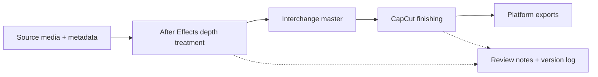

# DepthCraft Workflow Kit

An editable, production-oriented workflow template for combining the **BCC+ Depth Map ML** effect in Adobe After Effects with finishing and delivery in CapCut. This repository contains documentation, naming conventions, metadata examples, validation tools, and placeholder project structure—not media, binaries, or proprietary presets.

## What this is

DepthCraft helps creators and teams repeat a depth-aware compositing workflow:

1. Prepare and track source media.
2. Build the depth treatment in After Effects with your licensed BCC+ installation.
3. Render an interchange master.
4. Finish captions, pacing, graphics, and platform exports in CapCut.
5. Hand off color, audio, and delivery metadata consistently.

## Supported software guidance

| Tool | Guidance |
| --- | --- |
| Adobe After Effects | Use a currently supported release compatible with your production machine and the BCC+ release you own. |
| Boris FX Continuum / BCC+ | Install and license BCC+ Depth Map ML directly from Boris FX. This kit does not redistribute it. |
| CapCut | Use the current desktop release available for your operating system. Feature names and export limits can change. |
| Python | 3.9+ for the optional repository validator and tests. No third-party packages are required. |

Always confirm compatibility and licensing with the vendors before standardizing a team workstation.

## Proprietary-plugin and asset notice

This repository intentionally excludes Boris FX, Adobe, and CapCut binaries, installers, LUTs, stock footage, fonts, project files, effect presets, and other proprietary assets. References to vendor products are nominative and do not imply endorsement. Users must obtain and license their own software and media, then create/import their own presets where permitted.

## Quick start

```text
1. Copy templates/project-structure/ into a new production folder.
2. Duplicate examples/metadata.example.json as metadata.json and fill in project values.
3. Read docs/ae-depth-workflow.md and build the effect in an AE project.
4. Render an intermediate master using docs/export-handoff.md.
5. Finish timing, captions, graphics, and platform versions in CapCut.
6. Run python tools/validate_repo.py before sharing the repository or handoff.
```

The example metadata is a schema aid, not an Adobe, Boris FX, or CapCut import file.

## Workflow overview



See [docs/ae-depth-workflow.md](docs/ae-depth-workflow.md), [docs/bcc-depth-map-ml.md](docs/bcc-depth-map-ml.md), and [docs/capcut-finishing.md](docs/capcut-finishing.md) for the detailed process.

## Repository map

```text
docs/                       End-to-end workflow and handoff guidance
examples/                   Safe JSON/YAML metadata and settings examples
templates/project-structure Placeholder folders for a new production
tools/                      Dependency-light validation script
tests/                      Standard-library tests for the validator
.github/                    CI, issue forms, and pull-request template
```

## Troubleshooting

- **Depth edges crawl or flicker:** inspect the source for motion blur, low contrast, hair, glass, and rapid cuts; test shorter shots and use a stable reference frame where appropriate.
- **The effect is unavailable:** confirm BCC+ is installed, licensed, and compatible with the installed AE version. Do not copy plugin files from another machine.
- **CapCut looks different from the AE master:** verify frame rate, color interpretation, scaling, and that CapCut has not applied an automatic enhancement or HDR conversion.
- **Audio drifts:** keep one authoritative sample rate, conform frame rate before editing, and use the handoff checklist in [docs/color-audio-handoff.md](docs/color-audio-handoff.md).
- **Validator reports missing paths:** create the placeholder folders or update the repository structure intentionally; do not add proprietary assets to satisfy the check.

## Contributing

Documentation and tooling improvements are welcome. Read [CONTRIBUTING.md](CONTRIBUTING.md), keep examples vendor-neutral, and run:

```powershell
python -m unittest discover -s tests -v
python tools/validate_repo.py
```

## License

Original documentation and scripts are released under the [MIT License](LICENSE). Vendor names, applications, plugins, and any user-supplied media remain subject to their own terms.
